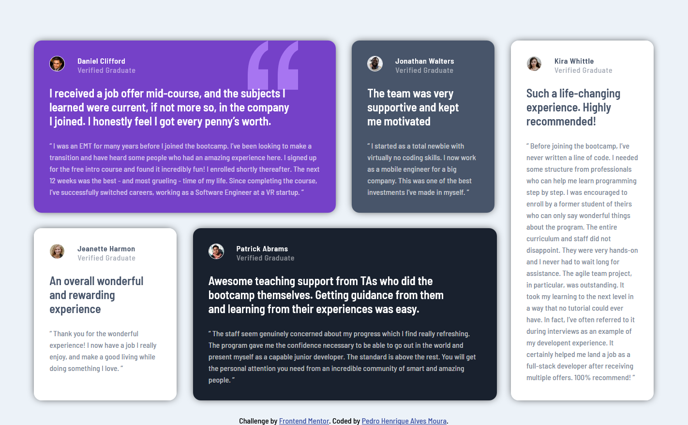

# Frontend Mentor - Testimonials grid section

This is a solution to the <a href="https://www.frontendmentor.io/challenges/testimonials-grid-section-Nnw6J7Un7" alt="Four card feature section">Testimonials grid section</a>  

*Frontend Mentor challenges help you improve your coding skills by building realistic projects.*

## Table of contents

- [Overview](#overview)
  - [The challenge](#the-challenge)
  - [Screenshots](#screenshots)
  - [Links](#links)
- [My process](#my-process)
  - [Built with](#built-with)
  - [What I learned](#what-i-learned)
  - [Continued development](#continued-development)
  - [Useful resources](#useful-resources)
- [Author](#author)

## Overview

### The challenge

Users should be able to:

- (V) View the optimal layout for the component depending on their device's screen size;
- (V) See hover states for all interactive elements throughout the site;

### Screenshots

  *OBS: THE IMAGES MAY NOT BE IN THE SAME SCALE.*

# MODEL - Frontend Mentor - Testimonials grid section

  

  

# MY SOLUTION - Frontend Mentor - Testimonials grid section

  

  

### Links

- Live Site URL: - <a href="https://pedro-testimonials-grid.netlify.app" target="_blank" alt="">testmonials-grid-section</a>

## My process

### Built with

- Semantic HTML5 markup
- Mobile-first workflow
- CSS Grid & Flexbox
- CSS animations 

### What I learned

In this project I learned how to set more complex grid layouts.  

### Continued development

I am not totally comfortable with CSS Grid and Media Queries yet, so I am going to continue focusing on it in future projects.

### Useful resources

- <a href="https://developer.mozilla.org/pt-BR/docs/Web/CSS/:first-child" target="_blank" alt="Link to CSS Layout - :first-child pseudo-class">Link to :first-child pseudo-class</a>
- <a href="https://www.w3schools.com/cssref/pr_grid-gap.asp" target="_blank" alt="CSS grid-gap Property">CSS grid-gap Property</a>
- <a href="https://css-tricks.com/snippets/css/complete-guide-grid/" target="_blank" alt="Link to A Complete Guide to Grid">A Complete Guide to Grid</a>
- <a href="https://www.w3schools.com/cssref/css3_pr_box-shadow.asp" target="_blank" alt="Link to CSS box-shadow Property">CSS box-shadow Property</a>
- <a href="https://developer.mozilla.org/pt-BR/docs/Web/CSS/transform" target="_blank" alt="CSS transform functions">CSS transform functions</a>

## Author

- Frontend Mentor - [@Pedrohamoura-Git](https://www.frontendmentor.io/profile/Pedrohamoura-Git)
- Instagram - [@ph_pedrohenrique21](https://www.instagram.com/ph_pedrohenrique21/)
